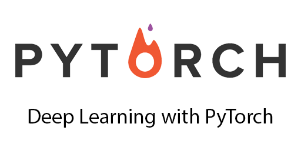

# Python Programming Language in AI

We all are in the era of [Artificial Intelligence](https://en.wikipedia.org/wiki/Artificial_intelligence). Tech giants like Google , Microsoft & Facebook investing in AI. **Amazon's Alexa** also shows the how tight compition going in to market of AI, not only Google & Apple but other companies also dominate the tech market if they have power of AI. There is huge opportunity in 2018 for people who looking for jobs in Machine Learning , Deep Learning & AI . Some times it seem like Machine Learning & AI both are same thing but actully their is a basic difference b/w them & In short, the best explanation defines this in better way is that:

> *Artificial Intelligence is the broader concept of machines being able to carry out tasks in a way that we would consider “smart”.*

Here I'm going to tell you about how a programming language plays a key roll in production of AI product & Thats true I'm talking about [Python](https://www.python.org/). If you looking for a oppportunity in AI, you must understand the power of Python.

### 1. About Python

Python is a powerful high-level, object-oriented and most popular open source programming language created by [Guido van Rossum](https://en.wikipedia.org/wiki/Guido_van_Rossum).
It has simple easy-to-use syntax, making it the perfect language for someone trying to learn computer programming for the first time. 

Python is a general-purpose language. It has wide range of applications from Web development (like: Django, Flask & Web2py), scientific and mathematical computing (Orange, SymPy, NumPy) to desktop graphical user Interfaces (Pygame, Panda3D). 

If you are beginner you can easily start with python.there is Huge Python Learning resource available on Internet. I suggest few books if you really don't know any thing about Python :

1. [Think Python: How to Think Like a Computer Scientist](http://www.greenteapress.com/thinkpython/thinkCSpy.pdf)
2. [Python for you and me](https://kushaldas.in/details/pym.pdf)
### 2. Python Library & Framework for AI

In this section, we will be looking at powerful, popular Python libraries that are used for artificial intelligence. We will be looking at their advantages & drawbacks, and their features. So, Let's begin and explore these fantastic Python libraries:

**1. TensorFlow:** 

TensorFlow is an open-source software library for dataflow programming and widely used for machine learning applications such as neural networks.TensorFlow was developed by the Google Brain team for internal Google use. It was released under the Apache 2.0 open source license on November 9, 2015

> *"Computation using data flow graphs for scalable machine learning."*

TensorFlow is an interface for expressing Machine Learning algorithm & implementation for executing such algorithm. It helps for creating ensemble algorithms for todays most challenging problems.

**Advantages :**

1. Flexible Structure
2. Rich Documentation with great community
3. Predefined implimentation available as well as open-source

**Drawbacks :**

1. It requires knowledge of Python
2. Conputation is bit slow
3. Overkill for simpler tasks

[Click Here For Documentation](https://www.tensorflow.org/)

**2. PyTorch :**

PyTorch is a Python-based open-source Machine Learning library with GPU support. PyTorch is a python package that provides two high-level features:
* Tensor computation (like numpy) with strong GPU acceleration
* Deep Neural Networks built on a tape-based autodiff system

PyTorch is a cousin of lua-based Torch framework which is actively used at Facebook. The main feature is that Neural Networks can be built dynamically making way for learning more advanced and complex AI tasks. 

> *"Best fits for those who looking for more Pythonic Environment."*

PyTorch is fast and lean because it gives feature to integrate acceleration libraries such as Intel MKL and NVIDIA (CuDNN, NCCL) to maximize speed.

> *"PyTorch is quite fast – whether you run small or large neural networks."*

**Advantages :**

1. Deep learning research platform that provides maximum flexibility
2. Fast & Lean
3. Pretty good documentation

**Drawbacks :**

1. PyTorch only supports linux and osx.

[Click Here For Documentation](http://pytorch.org/)

**3. Keras :**

Keras is an open-source high-level neural networks Library, written in Python. It is running on top of TensorFlow, CNTK, or Theano. Keras is an easy to use neural network library that promotes a simple and clean syntax. Keras is layer-oriented. I suggest use **Keras** If you're using known network design. 

Keras code is portable, There is no need to change your code written in Keras, whether you change your backend from Theano to TensorFlow. Keras is more mature then PyTorch with great community support.

**Advantages :**

1. Documentation is very clean 
2. Keras code is Portable
3. Community support is really good

**Drawbacks :**

1. keras is not good when you implement your own layers and doing prototyping and research

[Click Here For Documentation](https://keras.io/)

**4. Scikit Learn :**

Scikit-learn is probably the most useful library for machine learning in Python. Scikit-learn was initially developed by David Cournapeau as a Google summer of code project in 2007. It is on NumPy, SciPy and matplotlib, this library contains a lot of effiecient tools for machine learning and statistical modeling including classification, regression, clustering and dimensionality reduction.

The library is built upon the SciPy (Scientific Python) that must be installed before you can use scikit-learn. This stack that includes:

    NumPy: Base n-dimensional array package
    SciPy: Fundamental library for scientific computing
    Matplotlib: Comprehensive 2D/3D plotting
    IPython: Enhanced interactive console
    Sympy: Symbolic mathematics
    Pandas: Data structures and analysis

Scikit-Learn is characterized by a clean, uniform, and streamlined API, as well as by very useful and complete online documentation. A benefit of this uniformity is that once you understand the basic use and syntax of Scikit-Learn for one type of model, switching to a new model or algorithm is very straightforward.

**Advantages :**

1. Easy to use
2. supports most practical tasks

**Drawbacks :**

1. Bad for deep learning

[Click Here For Documentation](scikit-learn.org/)

### 3. Popular Implimented Projects in Python

Getting into Machine Learning and AI is not an easy task. Lots of effort put together for implimenting some useful task to build an AI model. Open source projects can be useful for data scientists. You can learn by reading the source code and build something on top of the existing projects. 

Lots of people start contributing to opensource just because of these awesome opensource projects. here I will tell you about five most populer opensource projects which are widely used for developing any AI models are as follows :

**1. TensorFlow :** 169% up, from 493 to 1453 contributors 

[Github Link](https://github.com/tensorflow/tensorflow)

**2. Keras :** 656 contributors

[Github Link](https://github.com/keras-team/keras)

**3. PyTorch :** 613 contributors

[Github Link](https://github.com/pytorch/pytorch)

**4. Scikit Learn :** 1069 contributors

[Github Link](https://github.com/scikit-learn/scikit-learn)

**5. Theano :** 330 contributors

[Github Link](https://github.com/Theano/Theano)

### 4. Motivation

Machine learning is about teaching computers how to learn from data to make decisions or predictions. For true machine learning, the computer must be able to learn to identify patterns without being explicitly programmed to.

You may also hear it labeled several other names or buzz words:

> Data Science, Big Data, Artificial Intelligence, Predictive Analytics, Computational Statistics, Data Mining, Etc...

The best way to dive in to AI is to learn thing by your own which is know as **The Self-Starter Way**. Self-Starter way is far better then academic apporoch where you don't have to follow lots of guidelines. **Doing Practice** is only way to learn things.

#### Keep Practice

## Happy Coding!
